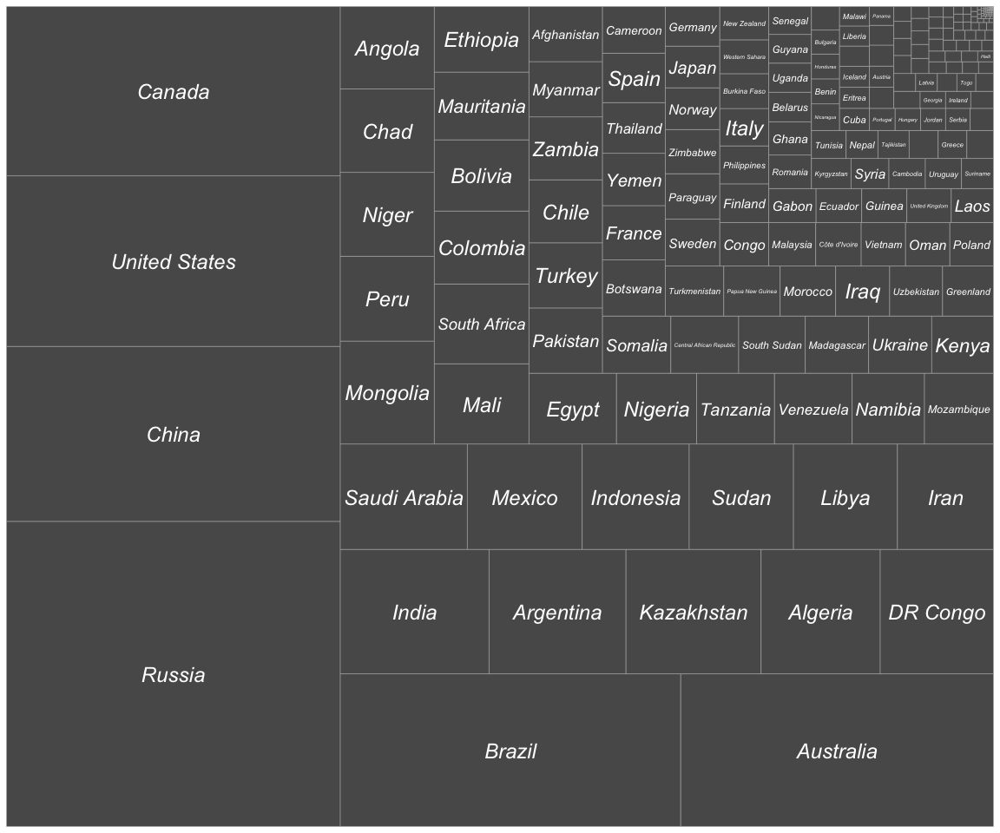
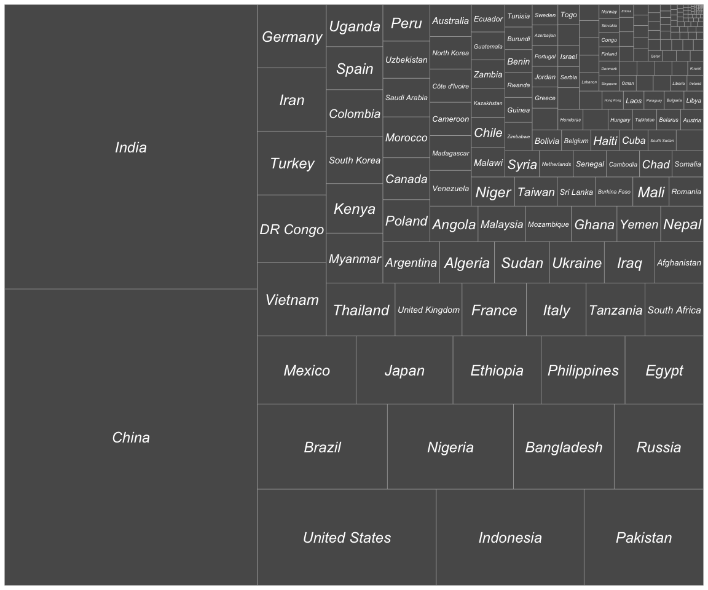

Country Size
================
Prabha Area
5/9/2021

## R Markdown

There are many type of world maps and the reason being no one map
project is truly correct way of the representing earth in a 2D surface.

You can refer to some of the map types here in
[futuremaps.com](https://futuremaps.com/blogs/news/top-10-world-map-projections).

I want to see the size of a country relative to each other which is hard
to see it in a map. Hence creating a treemap visual using R to showcase
this.

``` r
c= read_csv('countries_by_area.csv')
```

*data source:
[worldmeters.info](https://www.worldometers.info/world-population/population-by-country/)*

**By Land Area**

``` r
ggplot(c,aes(area = land_area_sq_km,label=country))+
  geom_treemap()+geom_treemap_text(fontface = 'italic',color="white",place="center")
```

<!-- -->

**By Population**

``` r
ggplot(c,aes(area = population,label=country))+
  geom_treemap()+geom_treemap_text(fontface = 'italic',color="white",place="center")
```

<!-- -->
