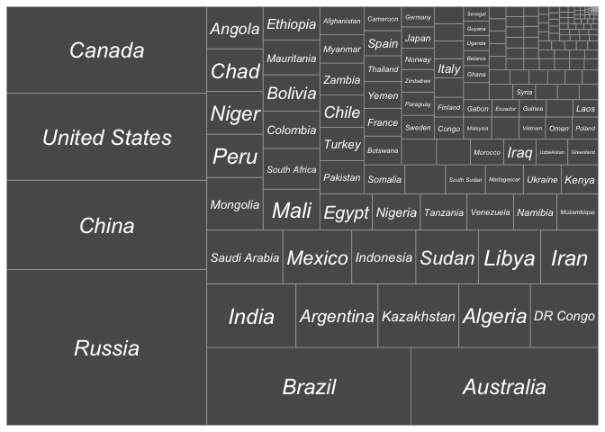

## R Markdown

This is an R Markdown document. Markdown is a simple formatting syntax for authoring HTML, PDF, and MS Word documents. For more details on using R Markdown see <http://rmarkdown.rstudio.com>.

When you click the **Knit** button a document will be generated that includes both content as well as the output of any embedded R code chunks within the document. You can embed an R code chunk like this:


```r
c= read_csv('countries_by_area.csv')
```

```
## 
## ── Column specification ────────────────────────────────────────────────────────
## cols(
##   country = col_character(),
##   population = col_number(),
##   land_area_sq_km = col_number()
## )
```

```r
ggplot(c,aes(area = land_area_sq_km,label=country))+ geom_treemap()+geom_treemap_text(fontface = 'italic',color="white",place="center")
```

<!-- -->

